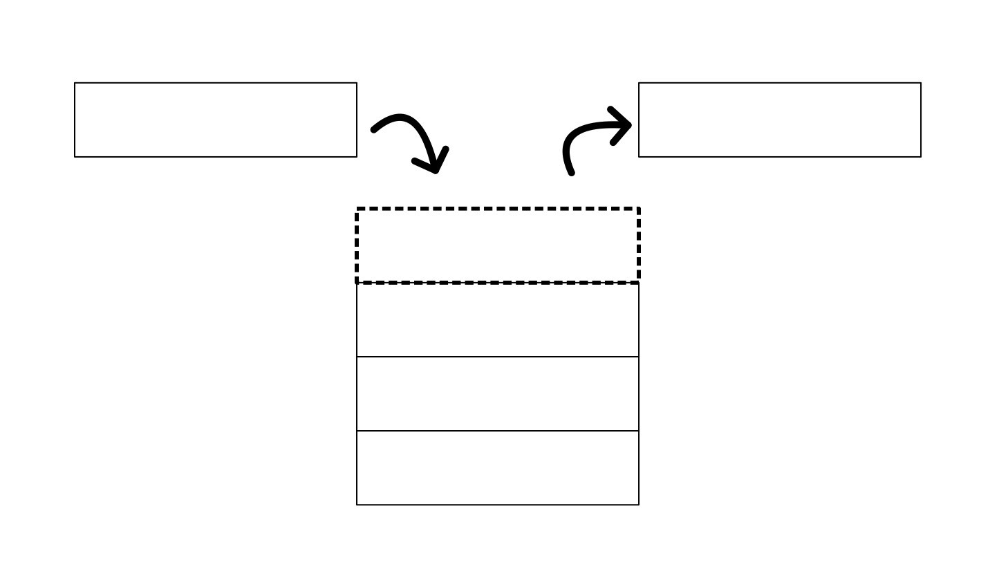

# Stack
[Go back](1-contents.md)
## Purpose and Example Code
A stack is a linear data structure. It stores data in a `Last-in/First-Out (LIFO)` way. One way to visualize this storage technique is to think of a stack of plates in a cafeteria. They are pushed up (typically by a spring mechanism) so that the top plate can always be taken first.  



In a stack, an element can only be added to one end and elements can only be removed from that same end:
```
stack = [1, 2, 3, 4]

stack.append(5)

stack # [1, 2, 3, 4, 5]

stack.pop() # 5
stack.pop() # 4
```

The operation used to add an item is the push() function (or append() if using a list), and to remove we use the pop() function. 

## Big-O Performance
Common Stack Operations | Description | Python Code | Performance
----------------------- | ----------- | ----------- | -----------
push(value) | Adds the "value" to the top of the stack. (end of the list) | stack.append(value) | O(1) Performance when pushing to the end of an array. 
pop() | Removes and returns the item from the top of the stack. (end of the list) | value = stack.pop() | O(1) Performance when popping from the end of an array. 
size() | Returns the size of the stack. | length = len(stack) | O(1) Performance since the size of an array is always stored. 
empty() | Returns true is the size of the stack is 0. | if len(stack) == 0 | O(1) Performance of checking the size. 

## Use Cases
* Useful when order is important.
* When you want to return the reverse of what was input. 
* Undo/Redo is done using a stack to keep track of what operations have been done. 
* The call stack when executing code. Each function is called off the top of the stack. 

## Python Implementation
A stack can be implemented in multiple ways. One way is a `list []` (array). Another is `collections.deque` (a python library) (linked list). 

A list is easy to understand for most and is very fast at locating data in a certain index location (list[3]), but collections.deque is much better in the sense of memory allocation. 

Since it uses a doubly linked list it is much easier to add a new "node" and allocate more memory to the "deque". This makes the push() function much faster. 
Since push() and pop() are used much more often than finding an index value in a stack, the collections.deque option is the better option most of the time. 

You can implement collections.deque as follows:
```
from collections import deque

stack = deque()

stack.append(1)
stack.append(2)
stack.append(3)

stack # outputs deque(['a', 'b', 'c'])

stack.pop() # 3
stack.pop() # 2
stack.pop() # 1

# the append() and pop() functions are used like with a list.
```

## Common Errors
* Trying to pop() from an empty list (or linked list) will throw an error. 
* Pushing something onto a full stack. A stack can only hold so many values before you reach a `stack overflow` and so you can run into issues with extremely large data sets. (You may have seen the stack overflow when using recursion without a base case.)

## Practice Problem
Given an array of numbers, write a function called "stack_sort" that returns a sorted list of the numbers in the least to greatest order using stack functions. (pop, append, etc.)

View the [sample solution](stack-possible-solution.py) after you have completed your implementation. 
```
trial1 = [1, 5, 9, 2, 4, 3] # expected output: [1, 2, 3, 4, 5, 9]
print(stack_sort(trial1))

trial2 = [20, 77, 31, 5, 8, 103, 66, 81] # expected output: [5, 8, 20, 31, 66, 77, 81, 103]
print(stack_sort(trial2))
```