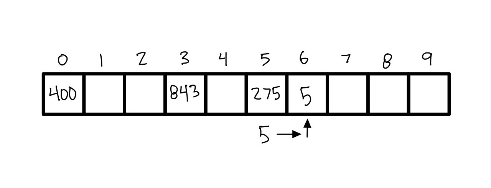
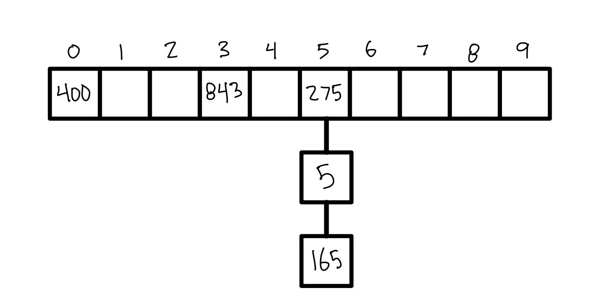

# Sets
[Go back](1-contents.md)
## Purpose and Example Code
A set is a way to store multiple things into a single variable, similar to a dictionary. One of the defining features of a set is that the data is not stored in any order, and therefore cannot be referenced by an index or a key. A set is placed into an array that has a fixed lenth, and values are placed into the array using hashing. 

A set is also able to store any combination of data:
``` 
set = {"abc", 123, False, 17.5}
```

### Hashing
The way a set stores its data is by using a technique called `hashing` (this allows for O(1) performance). Hashing is where you use a formula to turn any value (including strings) into a interger (`hash`), this interger can then be reverse engineered using the inverse hashing function to return the value. Hashing is also useful becasue you generate a unique int for every value, but it prevents duplicate values from being stored because they are simply overwritten in location. 

Say you have 4 values (could be ints, strings, etc): after they are hashed you end up with 400, 275, 5, and 843. If you are using an array that can only store up to ten values then you have a problem. You would need an array with size up to 843 to store all of these values, and then you would have a lot of wasted space. There is a way around this though, and it is by using modulo. A set typically has a function that will modulo all of the hashed values by the length of the array and then store the value in the returned values location. In our example:
```
arraySize = 10 # [0, 1, 2, 3, 4, 5, 6, 7, 8, 9]

400 % arraySize = 0 # array index 0
275 % arraySize = 5 # array index 5
5 % arraySize = 5 # also array index 5, uh oh
843 % arraySize = 3 # array index 3

# from this we end up with array locations of 0, 5, 5, and 3 to store our data.
```

### Handling Collisions
In the example above we ran into a problem, both the value 275 and 5 are trying to be stored in the 5th index location. There are two different ways to handle this conflict. The first way is to simply move the second value over one location, so 5 would be stored in index location 6 instead this is called `open addressing`. If the next slot if filled it continues to move forward (even looping back to the begining until it finds a free spot): 



The up side to this way of handling conflict is very fast if you only have one collision, but if you have a `cluster` of things that all have the same index then when looking up a value is has to search through more of the array and gets very, very slow. There is another way to open address using a binary search tree instead that keeps performance down to O(log n) which is useful for extreamly spread out (non-trending) data.

The second way to handle conflict is called `chaining`. When you chain a value you can add more than one value to a single index location by using a pointer to another location. All values are stored "in that index" and the you need to loop through the chain to see if the value is present:



The advantage of chaining is that if you have more values then the worst the performance can get is O(n) where n is the length of the chain. The disadvantage is that if you only have one collision then open addressing could be faster. 

To learn more about hashing [this website](https://www.geeksforgeeks.org/hashing-set-1-introduction/) is a pretty good introduction to hashing. And [this other website](https://runestone.academy/runestone/books/published/pythonds/SortSearch/Hashing.html) covers some more advanced topics like `conflict resolution` (when the intended hash location of multiple values are the same).

### Duplicate Values
Another important aspect of a set is that it does not allow for any duplicates. Since there are no duplicates in a set they are very useful for testing to see if a unique value is saved in the set (or testing for membership). 

If a duplicate is added, then it will not show up when displaying the set:
```
set1 = {"John", "Calvin", "Sarah", "John"}
print(set1)

{"Calvin", "John", "Sarah"}
```

Because of the fact, there is no order and there are no duplicate values allowed, sets can achieve O(1) performance for adding a value, removing a value, testing for membership, and returning the size.

## Big-O Performance
Common Set Operations | Description | Python Code | Performance
--------------------- | ----------- | ----------- | -----------
add(value) | Adds the "value" specified into the set. | set.add("value") | O(1) - Using hashing and assuming good conflict resolution. 
remove(value) | Removes the "value" specified from the set. | set.remove("value") | O(1) Using hashing and assuming good conflict resolution. 
member(value) | Checks for membership of the "value" in the set. | if value in set: | O(1) Using hashing and assuming good conflict resolution.
size() | Returns the number of items in the set. | length = len(set) | O(1) Since size of the set is always stored. 

## Use Cases
* Whenever you are storing unique values. 
* Creating a set of unique values from a list with duplicates.
* Check for `intersection` of values, and merge using `union`.
* When you only want to check for `membership` of a value.

## Python Implementation
To create a set in python you give it a name and then set it equal to the values placed in curly braces: 
```
my_set = {1, 2, 3}
```
If you want to make an empty set use the set() function:
```
my_set = set()
```

## Common Errors
* Trying to add duplicate values into your set. 
* Attempting to use set[i] to reference an index in a set (sets have no index references).
* Using a set in the wrong situation. If you want to do anything with the stored values (math, or functions), then a set is not the answer as it is only for testing membership.

## Practice Problem
Write a function that takes into two string sentences and then returns a list of the words that are the same within the sentence. Only return unique words. Below are test cases to use against your solution. (test cases may not be exhaustive)

After you have finished your implementation, compare it to the [sample solution](set-possible-solution.py).
```
trial_sentence_1 = 'How often does "the dog" jump over the far fence?'
trial_sentence_2 = "I wonder why my dog is always staring at my fence in the distance..."

common_words(trial_sentence_1, trial_sentence_2) # should output {'dog', 'the', 'fence'} order may not match

trial_sentence_1 = "I wonder how long this assignment has taken me in total?"
trial_sentence_2 = "This assignment has taken me far too long, but it was also very fun."

common_words(trial_sentence_1, trial_sentence_2) # should output {'me', 'long', 'assignment', 'has', 'taken', 'this'}

trial_sentence_1 = "These sentences are the exact same."
trial_sentence_2 = "These sentences are the exact same."

common_words(trial_sentence_1, trial_sentence_2) # should return every word, not in any particular order.
```

