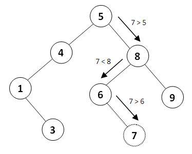
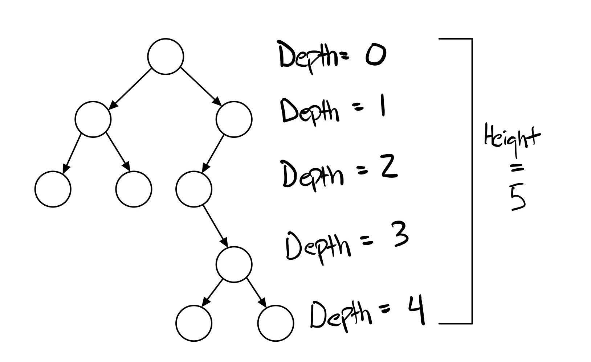
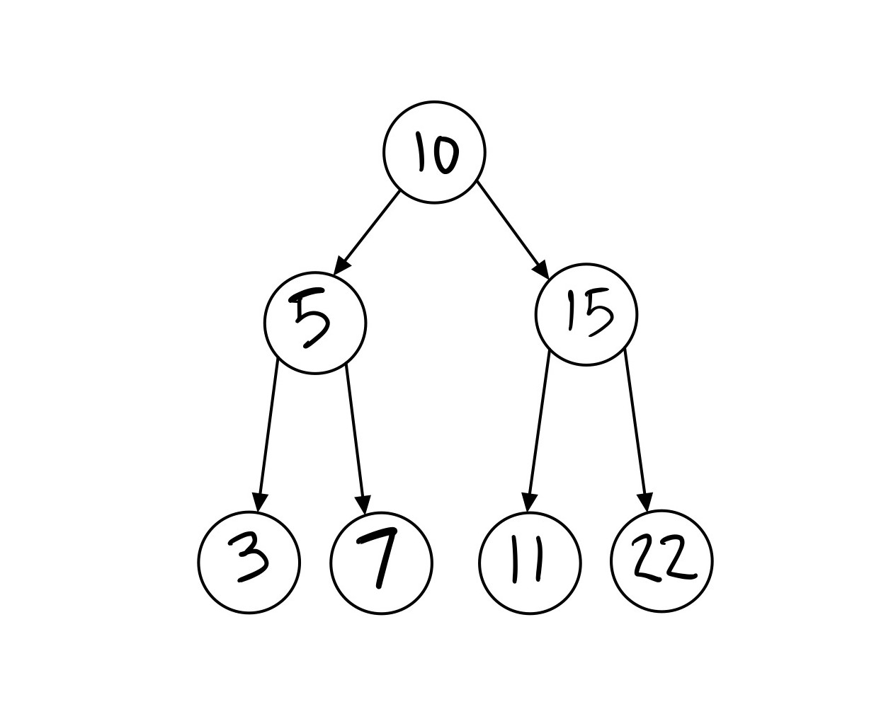

# Trees
[Go back](1-contents.md)
## Purpose and Example Code
Trees are a non-linear data structure. A way to visualize this is by visualizing an actual tree but flipped. A tree starts at the top with the `root node.` Each node that follows is a "child" of the root, and if a node had no children then it is a `leaf node.` Each node can only have one parent, and can only have up to two children. There are multiple kinds of trees but the one we will focus on in this tutorial is called a `binary search tree (BST).`

A binary search tree is "sorted" meaning that values that are less than the root are placed into the left subtree, and greater values are put into the right subtree. This pattern applies to every node that follows as well. By doing this the data is sorted when inserted into the BST. 

A value is added to a BST using an `insert function.` Insert looks at whether the value and sees if it greater than or less than the root and then moves it to the right or left. It then continues this process with each following node until there is an empty place to insert the value.



When looking at a binary tree we want it to be "balanced". When looking at balance we examine the `height` of the tree. To find the height we look at the distance from the root node to the leaf nodes. If there is a difference greater than 2 (>2) between any of the heights then the tree is not balanced. 



Below is some sample code using a BST class and the insert function, and what the BST would look like after these functions are executed:

```
bst = BST()
bst.insert(10)
bst.insert(5)
bst.insert(7)
bst.insert(15)
bst.insert(22)
bst.insert(3)
bst.insert(11)
```



## Big-O Performance
Common BST Operations | Description | Performance
--------------------- | ----------- | -----------
insert(value)         | Insert a value into the tree. | O(log n) - Splits the tree in half recursively to find the correct spot
remove(value)	| Remove a value from the tree.	 | O(log n) - Splits the tree in half recursively to find the value, and then remove it. 
contains(value)	| Determine if a value is in the tree.	| O(log n) - Splits the tree in half recursively to find the value.
traverse_forward | Goes through all objects smallest to greatest. | O(n) - Recursively traverse the left subtree and then the right subtree.
traverse_backward | Goes through all objects greatest to smallest. | O(n) - Recursively traverse the right subtree and then the right subtree. 
height(node)	| Determine the height of any given node. (providing the root gives the height of the tree) | O(n) - Recursively find the height of the left and right subtrees and then return the maximum height (plus one to account for the root).
size()	| Return the size of the BST.	| O(1) - The size is maintained within the BST class.
empty()	| Returns true if the root node is empty. | O(1) - The comparison of the root node or the size.

## Use Cases
* Storing large sets of data in order. 
* Any situation where things can be compared by less than greater than. 
* Search applications where data is constantly entering/leaving.

## Python Implementation
There is no built-in functionality for BTS's in Python. In this tutorial, a BST class will be given for the sample problem. Some packages can be installed by other developers that offer BST implementation such as [bintrees](https://pypi.org/project/bintrees/).

## Common Errors
* Creating an unbalanced tree that then loses its efficiency
* Base Cases! When doing anything with recursion a base case always needs to exist as a way to exit the function. 
* If insert allows for duplicate values...then adding duplicate values to a tree can be problematic.

## Practice Problem

Given a binary tree write a function that returns the summation of all of the nodes in the BST. (the BST class is provided for you below) (test cases and the expected output are below the code)

After you have finished the problem compare your solution to the [sample solution](trees-possible-solution.py).

```
class BST:
    """
    Implement the Binary Search Tree (BST) data structure.  The Node 
    class below is an inner class.  An inner class means that its real 
    name is related to the outer class.  To create a Node object, we will need to specify BST.Node
    """
    
    class Node:
        """
        Each node of the BST will have data and links to the 
        left and right sub-tree. 
        """

        def __init__(self, data):
            """ 
            Initialize the node to the data provided.  Initially
            the links are unknown so they are set to None.
            """
       
            self.data = data
            self.left = None
            self.right = None

    def __init__(self):
        """
        Initialize an empty BST.
        """
        self.root = None

    def insert(self, data):
        """
        Insert 'data' into the BST.  If the BST
        is empty, then set the root equal to the new 
        node.  Otherwise, use _insert to recursively
        find the location to insert.
        """
        if self.root is None:
            self.root = BST.Node(data)
        else:
            self._insert(data, self.root)  # Start at the root

    def _insert(self, data, node):
        """
        This function will look for a place to insert a node
        with 'data' inside of it.  The current sub-tree is
        represented by 'node'.  This function is intended to be
        called the first time by the insert function.
        """
        if data < node.data:
            # The data belongs on the left side.
            if node.left is None:
                # We found an empty spot
                node.left = BST.Node(data)
            else:
                # Need to keep looking.  Call _insert
                # recursively on the left sub-tree.
                self._insert(data, node.left)
        elif data > node.data:
            # The data belongs on the right side.
            if node.right is None:
                # We found an empty spot
                node.right = BST.Node(data)
            else:
                # Need to keep looking.  Call _insert
                # recursively on the right sub-tree.
                self._insert(data, node.right)
    
    def __iter__(self):
        """
        Perform a forward traversal (in order traversal) starting from 
	    the root of the BST.  This is called a generator function.
        This function is called when a loop	is performed:

        for value in my_bst:
            print(value)

        """
        yield from self._traverse_forward(self.root)  # Start at the root
        
    def _traverse_forward(self, node):
        """
        Does a forward traversal (in-order traversal) through the 
        BST.  If the node that we are given (which is the current
        sub-tree) exists, then we will keep traversing on the left
        side (thus getting the smaller numbers first), then we will 
        provide the data in the current node, and finally we will 
        traverse on the right side (thus getting the larger numbers last).

        The use of the 'yield' will allow this function to support loops
        like:

        for value in my_bst:
            print(value)

        The keyword 'yield' will return the value for the 'for' loop to
	    use.  When the 'for' loop wants to get the next value, the code in
	    this function will start back up where the last 'yield' returned a 
	    value.  The keyword 'yield from' is used when our generator function
        needs to call another function for which a `yield` will be called.  
        In other words, the `yield` is delegated by the generator function
        to another function.

        This function is intended to be called the first time by 
        the __iter__ function.
        """
        if node is not None:
            yield from self._traverse_forward(node.left)
            yield node.data
            yield from self._traverse_forward(node.right)

    def bst_sum(self):
        """
        Returns the sum of all of the data in the bst. 
        If the bst is empty then returns 0. 
        """
        if self.root is None:
            return 0
        else:
            self._bst_sum(self.root) #start at the root

    ##################
    Start Problem Here
    ##################
    def _bst_sum(self, node):


    ################
    End Problem Here
    ################
```
```
bst = BST()
print(bst.bst_sum()) # 0
bst.insert(10)
print(bst.bst_sum()) # 10
bst.insert(22)
bst.insert(1)
bst.insert(5)
print(bst.bst_sum()) # 38
bst.insert(17)
bst.insert(9)
bst.insert(30)
print(bst.bst_sum()) # 94
```
